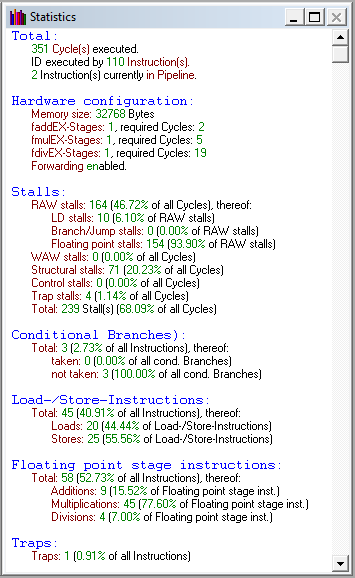
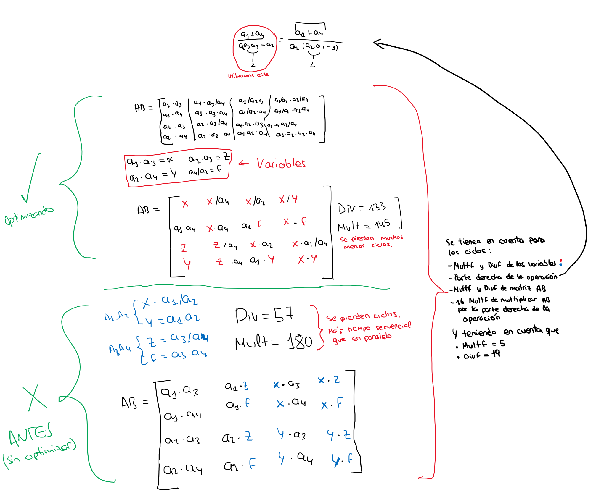
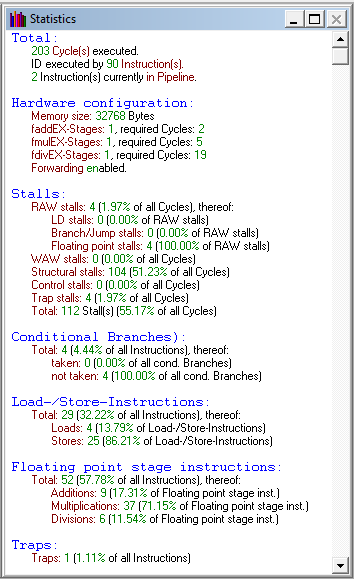

# Práctica DLX

Fecha de entrega 21 de Mayo de 2021

## Integrantes

* [Sergio García González](https://github.com/AnOrdinaryUsser)
* Pablo Jesús González Rubio

## Nota Final:

## Enunciado

Es [este documento](docs/Enunciado.pdf).

## Resolución

Estadísticas del código sin optimizar, haciendo las operaciones sin importar mucho el uso de registros y orden de las instrucciones. Se consiguen **351 ciclos**.

Haciendo las siguientes cuentas, haciendo factor común a las multiplicaciones, conseguimos reducir enormemente la cantidad de ciclos pues las divisiones y las multiplicaciones se hacen en paralelo.

Y por último reordenamos algunas instrucciones que tenían dependencias y conseguimos bajar a **203 ciclos**.

Por lo tanto, **hemos conseguido reducir 148 ciclos**.

Para una explicación más detallada, tenemos el [informe final](docs/InformeFinal.pdf) que entregamos.

## Documentos adicionales

* [Resumen Instrucciones DLX](docs/ResumenInstruccionesDLX.pdf)
